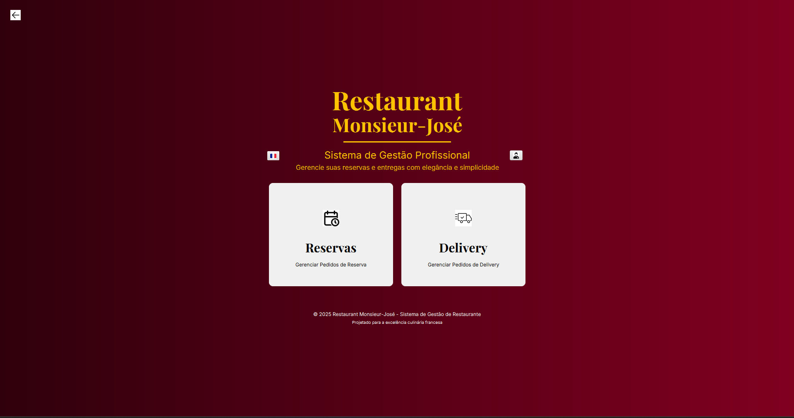

# TP1 - Projeto de Técnicas de Programação 1

## Visão Geral do Projeto

Este projeto, desenvolvido para a disciplina de Técnicas de Programação 1 (TP1), é uma aplicação em Java focada no aprendizado e aplicação de conceitos fundamentais de Programação Orientada a Objetos (POO). Ele também explora a criação de interfaces gráficas de usuário (GUI) utilizando JavaFX, e a persistência de dados através de tecnologias como Maven como builder, ORM (Hibernate), banco de dados MySQL e Docker para gerenciamento do ambiente de banco de dados. A senha de Administrador no programa é PSG5-0

## Objetivos de Aprendizagem

* **Programação Orientada a Objetos (POO):** Compreender e aplicar os pilares da POO, como encapsulamento, herança, polimorfismo e abstração, na construção de um sistema robusto e modular.
* **JavaFX:** Desenvolver interfaces gráficas de usuário interativas e responsivas, utilizando os recursos e componentes da biblioteca JavaFX.
* **Maven:** Builder para facilitar gerenciamento de arquivos e dependências
* **ORM (Hibernate):** Aprender a mapear objetos Java para tabelas de banco de dados e vice-versa, utilizando o Hibernate para simplificar a interação com o banco de dados.
* **Banco de Dados MySQL:** Configurar e interagir com um banco de dados relacional MySQL para armazenamento e recuperação de dados da aplicação.
* **Docker:** Utilizar Docker para empacotar e gerenciar o ambiente do banco de dados MySQL, facilitando a configuração e manipulação do mesmo em diferentes ambientes de desenvolvimento.

## Estrutura do Projeto

O projeto é dividido em módulos lógicos que representam as diferentes camadas da aplicação:

* **`classes/`**: Contém as classes que representam as entidades do domínio do problema (ex: `Cliente`, `Funcionario`, `Pedido`, `Prato`, `Ingrediente`, etc.), aplicando os princípios de POO.
* **`database/`**: Inclui a configuração do Hibernate e a lógica para interação com o banco de dados MySQL.
* **`app/`**: Contém os arquivos nativos e controladores Java para as telas da interface gráfica desenvolvidas com JavaFX.

## Tecnologias Utilizadas

* **Linguagem de Programação:** Java
* **Builder:** Maven
* **Interface Gráfica (GUI):** JavaFX
* **Mapeamento Objeto-Relacional (ORM):** Hibernate (com JPA)
* **Banco de Dados:** MySQL
* **Virtualização/Conteinerização:** Docker

## Como Executar o Projeto

Para configurar e executar este projeto em sua máquina local, siga os passos abaixo:

### Pré-requisitos

Certifique-se de ter as seguintes ferramentas instaladas:

* **JDK (Java Development Kit) 17 ou superior**
* **Maven** (para gerenciamento de dependências)
* **Docker Desktop** (ou Docker Engine)
* **Um IDE** como IntelliJ IDEA, Eclipse ou VS Code com suporte a Java e Maven.
* **(Opcional) MySQL Workbench:** Ferramenta gráfica para gerenciar seu banco de dados MySQL.

### Passos para Configuração e Execução

1.  **Clone o Repositório:**
    ```bash
    git clone https://github.com/RobertorNeto/Restaurante-Monsieur
    cd ./Restaurante-Monsieur
    ```

2.  **Configurar o Banco de Dados com Docker:**
    * Navegue até a raiz que contém o `Docker-Compose`.
    * Construa e inicie o container MySQL.:
        ```bash
        docker-compose up -d
        ```
        *(Isso iniciará um container MySQL no Docker. As credenciais e a porta devem estar configuradas no `docker-compose.yml` ou em variáveis de ambiente.)*

3.  **Configurar o Banco de Dados MySQL (Manual/Opcional):**
    * Se você deseja uma configuração manual ou precisa de controle via interface gráfica:
        * Baixe e instale o [MySQL Workbench](https://www.mysql.com/products/workbench/).
        * Crie uma nova conexão no MySQL Workbench.
        * **Usuário:** `root`
        * **Senha:** `senha123` (ou a senha que você configurou no seu `docker-compose.yml` ou `Dockerfile`).
        * **Porta:** Por padrão, o MySQL no Docker pode ser mapeado para a porta `3306`. Verifique a configuração do seu `docker-compose.yml`.
        * Após conectar, crie um novo esquema (banco de dados) com o nome `restaurantemonsieur`. Você pode fazer isso executando o seguinte comando SQL na aba de query:
            ```sql
            CREATE DATABASE IF NOT EXISTS restaurantemonsieur;
            ```
        * **Importante:** No arquivo `src/main/resources/META-INF/persistence.xml`, verifique a string de conexão JDBC. Certifique-se de que a porta esteja definida como `3306` (ou a porta que seu container Docker está utilizando) e que o usuário e senha correspondam aos que você está usando (padrão esperado: `user="root"` e `password="senha123"`). Exemplo de ajuste:
            ```xml
            <property name="jakarta.persistence.jdbc.url" value="jdbc:mysql://localhost:3306/restaurantemonsieur?createDatabaseIfNotExist=true"/>
            <property name="jakarta.persistence.jdbc.user" value="root"/>
            <property name="jakarta.persistence.jdbc.password" value="senha123"/>
            ```
4.  **Configuração JavaFX para IntelliJ IDEA (Opcional):**
    * Se você estiver usando o IntelliJ IDEA para desenvolver e executar a aplicação JavaFX, siga estes passos para configurar o SDK do JavaFX:
        1.  Baixe o SDK do JavaFX para sua plataforma (ex: `openjfx-24.0.1_windows-x64_bin-sdk.zip`) do site oficial do OpenJFX.
        2.  Descompacte o arquivo `.zip` em um local de sua preferência (ex: `C:\openjfx-24.0.1_windows-x64_bin-sdk\javafx-sdk-24.0.1`).
        3.  No IntelliJ IDEA, vá em `File > Project Structure...` (ou `Ctrl+Alt+Shift+S`).
        4.  Na janela `Project Structure`, selecione `Libraries` no painel esquerdo.
        5.  Clique no sinal de `+` e escolha `Java`.
        6.  Navegue até a pasta `lib` dentro do diretório onde você descompactou o SDK do JavaFX (ex: `C:\openjfx-24.0.1_windows-x64_bin-sdk\javafx-sdk-24.0.1\lib`). Selecione-a e clique em `OK`.
        7.  Adicione essa biblioteca ao seu módulo clicando em `Add to Modules` e selecionando o módulo principal do seu projeto. Clique em `OK`.
        8.  Agora, para executar a aplicação JavaFX, você precisará adicionar as opções de VM (Virtual Machine) à sua configuração de execução:
            * Vá em `Run > Edit Configurations...`.
            * Selecione sua configuração de execução da aplicação (geralmente `App` ou `Main`).
            * No campo `VM options`, adicione a seguinte linha, ajustando o caminho para o seu SDK do JavaFX:
                ```
                --module-path "C:\openjfx-24.0.1_windows-x64_bin-sdk\javafx-sdk-24.0.1\lib" --add-modules javafx.controls,javafx.fxml,javafx.web
                ```
                *(Substitua o caminho `"C:\openjfx-24.0.1_windows-x64_bin-sdk\javafx-sdk-24.0.1\lib"` pelo caminho real para a pasta `lib` do seu SDK do JavaFX.)*
            * Clique em `Apply` e depois em `OK`.

5.  **Configurar o Hibernate:**
    * Verifique o arquivo `src/main/resources/META-INF/persistence.xml` (ou o caminho equivalente) para garantir que as configurações de conexão com o banco de dados (URL, usuário, senha) correspondam às do seu container Docker MySQL.

6.  **Construir o Projeto com Maven:**
    * No diretório raiz do projeto, execute o Maven para baixar as dependências e compilar o código:
        ```bash
        mvn clean install
        ```

7.  **Executar a Aplicação:**
    * Você pode executar a aplicação através do seu IDE (localizando a classe `Main` ou a classe principal da aplicação JavaFX e executando-a).
    * Alternativamente, após a fase `install` do Maven, um JAR executável pode ter sido gerado na pasta `target`. Você pode executá-lo via linha de comando (se o `pom.xml` estiver configurado para gerar um JAR executável JavaFX):
        ```bash
        java -jar target/nome-do-seu-jar.jar
        ```
        *(Substitua `nome-do-seu-jar.jar` pelo nome real do arquivo JAR gerado.)*

8.  **Imagem de Referência Tela Inicial:**
    

## 👥 Colaboradores

Agradecemos às seguintes pessoas que contribuíram para este projeto:

<br>

<table>
  <tr>
    <td align="center">
      <a href="https://github.com/daviggalvao">
        
        <br />
        <sub>
          <b>daviggalvao</b>
        </sub>
      </a>
    </td>
    <td align="center">
      <a href="https://github.com/RobertorNeto">
        
        <br />
        <sub>
          <b>RobertorNeto</b>
        </sub>
      </a>
    </td>
    <td align="center">
      <a href="https://github.com/Redondave">
        
        <br />
        <sub>
          <b>Redondave</b>
        </sub>
      </a>
    </td>
    <td align="center">
      <a href="https://github.com/TagFernandes">
        
        <br />
        <sub>
          <b>TagFernandes</b>
        </sub>
      </a>
    </td>
  </tr>
</table>
